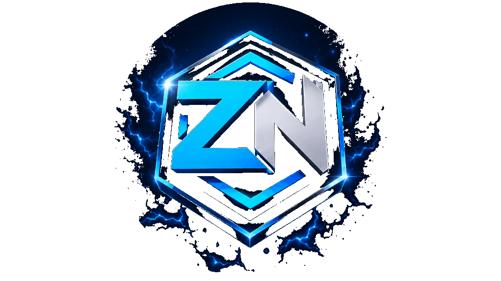

  
  <h1>ZyroNetwork School</h1>
  
<strong>The ultimate, highly detailed learning hub for Minecraft Bedrock development.</strong>

  
  

---

Welcome to the **ZyroNetwork School** open-source repository! This project serves as the central documentation and learning platform for the ZyroNetwork community. 

Our mission is to provide the most comprehensive, easy-to-read, and detailed guides for creating plugins on various high-performance Bedrock server softwares like PocketMine-MP, Nukkit, and Dragonfly.

## 🚀 Features

- **Extremely Detailed Guides**: Deep dives into APIs, lifecycle events, commands, and modern standards (like strict typing in PHP 8.1+).
- **Practical Sandboxes**: No installation required! Instantly launch a browser-based VS Code environment via GitHub Codespaces to test code live.
- **Mobile Optimized**: Built on a modern static site architecture (Docusaurus) for lightning-fast, responsive reading anywhere.

## 💻 Practical Sandbox (Develop in Browser)

Want to start coding immediately without downloading any software? 

Simply click the **Code** button at the top of this repository, select the **Codespaces** tab, and launch a new codespace. You will be greeted with a fully provisioned VS Code instance in your browser loaded with PHP 8.1, ready to run a test PocketMine-MP server!

## 🤝 Contributing

This is an open-source initiative by the ZyroNetwork team, and we welcome contributions from everyone! If you spot a typo, want to improve a tutorial, or wish to add a brand new guide:

1. Fork this repository.
2. Edit the Markdown (`.md`) files inside the `docs/` or `blog/` directories.
3. Submit a Pull Request.

Our CI/CD pipeline will automatically build and deploy your approved changes to the live website.

## 📜 License & Credits

Designed and maintained with passion by the **ZyroNetwork team**,**jeantkg** and **nk-archives**
All educational content and site design is Copyright © ZyroNetwork.

[Join the ZyroNetwork Discord](https://discord.gg/YznYkMuRUG) | [ZyroNetworkMC GitHub](https://github.com/ZyroNetworkMC)
