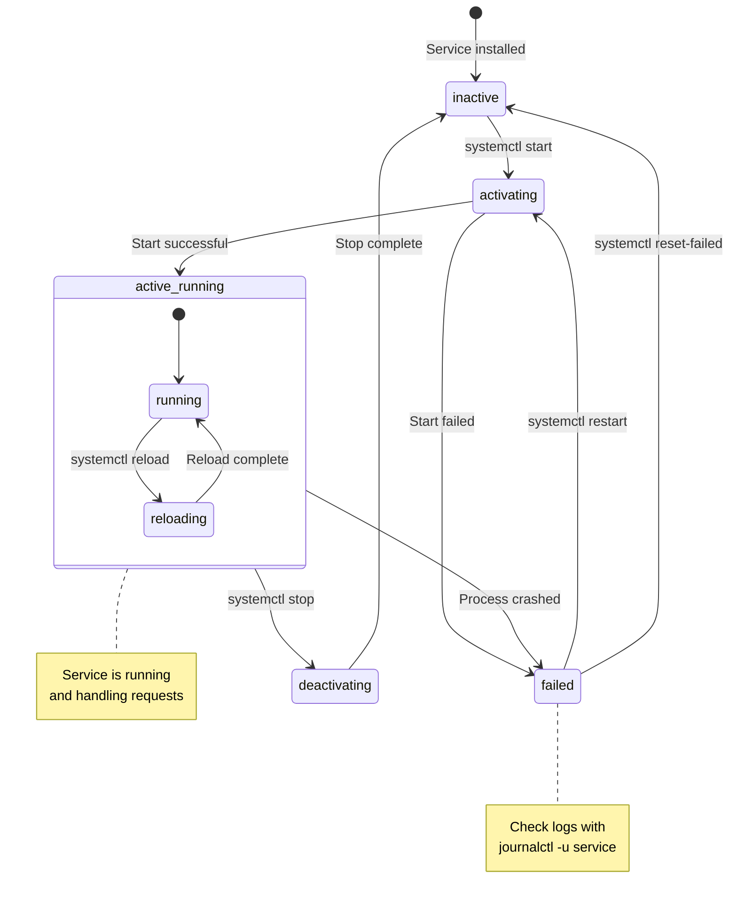

# Server Administration

Running a Linux server means keeping it updated, secure, monitored, and organized. This guide covers everything a sysadmin needs — from installing software and managing users to wrangling processes, automating tasks, and debugging network issues.

This is the stuff that separates someone who can `ssh` into a server from someone who can actually keep one running.

---

## Package Management

Package managers handle installing, updating, and removing software. Different distro families use different managers.

### APT (Debian/Ubuntu)

`apt` is the package manager for Debian-based systems. It downloads pre-compiled software from online repositories.

```bash
# Update package lists (always do this first)
sudo apt update

# Upgrade all installed packages
sudo apt upgrade -y

# Full upgrade (handles dependencies, removes obsolete packages)
sudo apt full-upgrade -y

# Install a package
sudo apt install htop -y
sudo apt install php8.3 php8.3-cli php8.3-xml -y

# Remove a package
sudo apt remove htop
sudo apt purge htop                # Remove + delete config files
sudo apt autoremove                # Remove unused dependencies

# Search for packages
apt search nginx
apt show nginx                     # Detailed package info
apt list --installed               # List all installed packages
apt list --upgradable              # List packages with available updates

# Fix broken dependencies
sudo apt --fix-broken install

# Clean up cached packages
sudo apt clean                     # Remove all cached .deb files
sudo apt autoclean                 # Remove old cached .deb files
```

### DNF/YUM (RHEL/Rocky/Alma)

`dnf` is the modern replacement for `yum` on Red Hat-based systems.

```bash
# Update package lists and upgrade
sudo dnf check-update
sudo dnf upgrade -y

# Install a package
sudo dnf install htop -y
sudo dnf install epel-release -y   # Enable EPEL repository

# Remove a package
sudo dnf remove htop

# Search
dnf search nginx
dnf info nginx
dnf list installed

# Group install
sudo dnf groupinstall "Development Tools"

# Clean cache
sudo dnf clean all
```

### Package Manager Comparison

| Feature | APT (Debian/Ubuntu) | DNF (RHEL/Rocky) |
|---|---|---|
| **Update cache** | `apt update` | `dnf check-update` |
| **Upgrade all** | `apt upgrade` | `dnf upgrade` |
| **Install** | `apt install pkg` | `dnf install pkg` |
| **Remove** | `apt remove pkg` | `dnf remove pkg` |
| **Purge (remove + config)** | `apt purge pkg` | `dnf remove pkg` |
| **Search** | `apt search term` | `dnf search term` |
| **Package info** | `apt show pkg` | `dnf info pkg` |
| **List installed** | `apt list --installed` | `dnf list installed` |
| **Clean cache** | `apt clean` | `dnf clean all` |
| **Fix broken** | `apt --fix-broken install` | `dnf distro-sync` |
| **Package format** | `.deb` | `.rpm` |
| **Repo config** | `/etc/apt/sources.list.d/` | `/etc/yum.repos.d/` |

:::tip Adding Third-Party Repositories (Ubuntu)
To install the latest PHP for PocketMine-MP:
```bash
sudo add-apt-repository ppa:ondrej/php -y
sudo apt update
sudo apt install php8.3 php8.3-cli php8.3-xml php8.3-mbstring -y
```
PPAs (Personal Package Archives) let you install newer software than the default Ubuntu repos provide.
:::

---

## User Management

Never run game servers as root. Create dedicated users with limited permissions.

### Creating Users

```bash
# Create a user with home directory
sudo useradd -m -s /bin/bash mcserver
# -m creates the home directory (/home/mcserver)
# -s sets the default shell

# Create user and set password immediately
sudo useradd -m -s /bin/bash mcserver
sudo passwd mcserver

# Create system user (no login, for running services)
sudo useradd -r -s /usr/sbin/nologin pmmp-service

# Create user with specific UID, groups, and home directory
sudo useradd -m -u 1500 -g developers -G sudo,docker -s /bin/bash devuser
```

### Modifying Users

```bash
# Change password
sudo passwd username

# Add user to a group
sudo usermod -aG sudo mcserver           # Add to sudo group
sudo usermod -aG docker mcserver         # Add to docker group

# Change default shell
sudo usermod -s /bin/zsh username

# Lock/unlock account
sudo usermod -L username                 # Lock account
sudo usermod -U username                 # Unlock account

# Change home directory
sudo usermod -d /new/home -m username    # -m moves existing files

# Set account expiration
sudo usermod -e 2026-12-31 tempuser
```

### Deleting Users

```bash
sudo userdel username                    # Delete user (keep home directory)
sudo userdel -r username                 # Delete user + home directory + mail
```

### Groups

```bash
# List user's groups
groups                                   # Current user's groups
groups mcserver                          # Specific user's groups
id mcserver                              # Detailed UID/GID info

# Create a group
sudo groupadd gameservers

# Add user to group
sudo usermod -aG gameservers mcserver

# Remove user from group
sudo gpasswd -d mcserver gameservers

# Delete a group
sudo groupdel gameservers

# List all groups
cat /etc/group
```

### sudo Configuration

`sudo` lets users run commands as root. It's configured in `/etc/sudoers`.

```bash
# ALWAYS use visudo to edit sudoers (it validates syntax)
sudo visudo
```

Common sudoers configurations:

```bash
# /etc/sudoers entries

# Allow user full sudo access
mcserver ALL=(ALL:ALL) ALL

# Allow without password (convenient but less secure)
mcserver ALL=(ALL:ALL) NOPASSWD: ALL

# Allow specific commands only
mcserver ALL=(ALL) NOPASSWD: /bin/systemctl restart pmmp, /bin/systemctl status pmmp

# Allow group
%gameservers ALL=(ALL:ALL) ALL
```

:::warning Never Edit /etc/sudoers Directly
Always use `sudo visudo`. It validates the syntax before saving. A syntax error in `/etc/sudoers` can lock you out of sudo entirely, leaving you unable to administer the system.
:::

---

## Process Management

Every running program is a process. Understanding processes is critical for troubleshooting performance issues and managing your game server.

### Viewing Processes

```bash
# ps — Snapshot of current processes
ps                                # Your processes only
ps aux                            # ALL processes, detailed
ps aux | grep php                 # Find PHP processes
ps -ef                            # Full format listing
ps -eo pid,ppid,cmd,%mem,%cpu --sort=-%mem | head -20  # Top 20 by memory

# top — Real-time process monitor
top                               # Interactive process viewer
# Press 'q' to quit, 'M' to sort by memory, 'P' by CPU, 'k' to kill

# htop — Better top (install it if not present)
sudo apt install htop -y
htop                              # Color-coded, mouse-supported, intuitive
```

#### Reading `ps aux` Output

```
USER       PID %CPU %MEM    VSZ   RSS TTY  STAT START   TIME COMMAND
root         1  0.0  0.3 169356 12532 ?    Ss   Jul10   0:05 /sbin/init
mcserver  1234 15.2  8.5 524288 349525 ?   Sl   14:30   2:15 php /opt/pmmp/PocketMine-MP.phar
```

| Column | Meaning |
|---|---|
| `USER` | Process owner |
| `PID` | Process ID (unique identifier) |
| `%CPU` | CPU usage percentage |
| `%MEM` | Memory usage percentage |
| `VSZ` | Virtual memory size (KB) |
| `RSS` | Resident memory — actual RAM used (KB) |
| `TTY` | Terminal (? = no terminal / daemon) |
| `STAT` | Process state (S=sleeping, R=running, Z=zombie) |
| `START` | Start time |
| `TIME` | Total CPU time consumed |
| `COMMAND` | The command that started this process |

### Killing Processes

```bash
# Kill by PID
kill 1234                         # Send SIGTERM (graceful shutdown)
kill -9 1234                      # Send SIGKILL (force kill, last resort)
kill -15 1234                     # Explicit SIGTERM

# Kill by name
killall php                       # Kill all processes named "php"
pkill -f "PocketMine"            # Kill processes matching pattern

# Kill signals reference
kill -l                           # List all signals
```

| Signal | Number | Action | Use Case |
|---|---|---|---|
| `SIGTERM` | 15 | Graceful termination | Default, lets process clean up |
| `SIGKILL` | 9 | Forced termination | Unresponsive processes |
| `SIGHUP` | 1 | Hangup / reload | Reload configuration |
| `SIGSTOP` | 19 | Pause process | Suspend without killing |
| `SIGCONT` | 18 | Resume process | Continue a stopped process |
| `SIGINT` | 2 | Interrupt | Same as pressing Ctrl+C |

### Process Priority and Background Jobs

```bash
# nice — Start process with adjusted priority (-20 highest, 19 lowest)
nice -n 10 ./heavy-task.sh        # Start with lower priority
sudo nice -n -5 ./important.sh   # Start with higher priority (needs root)

# renice — Change priority of running process
sudo renice -5 -p 1234           # Increase priority of PID 1234

# Background jobs
./long-script.sh &                # Start in background
command &                         # Run any command in background
jobs                              # List background jobs
fg %1                             # Bring job 1 to foreground
bg %1                             # Resume stopped job in background
Ctrl+Z                            # Suspend current foreground process

# nohup — Keep process running after logout
nohup ./start.sh &                # Won't die when you disconnect
nohup ./start.sh > output.log 2>&1 &  # With output redirection
```

:::tip For Game Servers, Use systemd
While `nohup` and `screen` work, `systemd` services are the proper way to run game servers that need to survive reboots and disconnects. We cover that next.
:::

---

## systemd Services

`systemd` is the init system and service manager on modern Linux. It starts services at boot, manages dependencies, and handles restarts automatically.

### The systemd Service Lifecycle



### Basic systemctl Commands

```bash
# Service control
sudo systemctl start nginx                # Start a service
sudo systemctl stop nginx                 # Stop a service
sudo systemctl restart nginx              # Stop + start
sudo systemctl reload nginx               # Reload config without restart
sudo systemctl status nginx               # Check status (detailed)

# Enable/disable at boot
sudo systemctl enable nginx               # Start on boot
sudo systemctl disable nginx              # Don't start on boot
sudo systemctl enable --now nginx         # Enable + start immediately

# Check if enabled/active
systemctl is-active nginx                 # Returns "active" or "inactive"
systemctl is-enabled nginx                # Returns "enabled" or "disabled"

# List services
systemctl list-units --type=service       # All loaded services
systemctl list-units --type=service --state=running  # Running only
systemctl list-unit-files --type=service  # All installed services

# Reload systemd after editing unit files
sudo systemctl daemon-reload
```

### Creating a Custom Service for PocketMine-MP

Create a service file at `/etc/systemd/system/pmmp.service`:

```ini
[Unit]
Description=PocketMine-MP Minecraft Bedrock Server
Documentation=https://pmmp.io
After=network.target
Wants=network-online.target

[Service]
Type=simple
User=mcserver
Group=mcserver
WorkingDirectory=/opt/pmmp
ExecStart=/usr/bin/php /opt/pmmp/PocketMine-MP.phar
ExecStop=/bin/kill -SIGTERM $MAINPID
Restart=on-failure
RestartSec=10
StandardOutput=journal
StandardError=journal

# Security hardening
NoNewPrivileges=true
PrivateTmp=true
ProtectSystem=strict
ReadWritePaths=/opt/pmmp

# Resource limits
LimitNOFILE=65535
MemoryMax=2G
CPUQuota=150%

[Install]
WantedBy=multi-user.target
```

Activate the service:

```bash
sudo systemctl daemon-reload
sudo systemctl enable --now pmmp
sudo systemctl status pmmp
```

### Service File Sections Explained

| Section | Directive | Purpose |
|---|---|---|
| `[Unit]` | `Description` | Human-readable name |
| | `After` | Start after these services |
| | `Wants` | Soft dependency (don't fail if missing) |
| | `Requires` | Hard dependency (fail if missing) |
| `[Service]` | `Type` | `simple`, `forking`, `oneshot`, `notify` |
| | `User` / `Group` | Run as this user/group |
| | `WorkingDirectory` | Set working directory |
| | `ExecStart` | Command to start the service |
| | `ExecStop` | Command to stop the service |
| | `Restart` | `always`, `on-failure`, `on-abnormal`, `no` |
| | `RestartSec` | Wait time before restart |
| | `LimitNOFILE` | Max open file descriptors |
| | `MemoryMax` | Memory limit |
| `[Install]` | `WantedBy` | Which target enables this service |

---

## Cron Jobs — Scheduled Tasks

Cron runs commands on a schedule. It's how you automate backups, cleanups, restarts, and maintenance tasks.

### Editing Crontab

```bash
crontab -e                        # Edit your user's crontab
sudo crontab -e                   # Edit root's crontab
crontab -l                        # List current cron jobs
crontab -r                        # Remove all cron jobs (careful!)
sudo crontab -u mcserver -l       # List another user's crontab
```

### Cron Syntax

```
┌───────────── minute (0–59)
│ ┌───────────── hour (0–23)
│ │ ┌───────────── day of month (1–31)
│ │ │ ┌───────────── month (1–12)
│ │ │ │ ┌───────────── day of week (0–7, 0 and 7 = Sunday)
│ │ │ │ │
* * * * * command_to_execute
```

### Cron Schedule Reference

| Expression | Schedule |
|---|---|
| `* * * * *` | Every minute |
| `*/5 * * * *` | Every 5 minutes |
| `0 * * * *` | Every hour (at minute 0) |
| `0 */2 * * *` | Every 2 hours |
| `0 0 * * *` | Daily at midnight |
| `0 6 * * *` | Daily at 6:00 AM |
| `30 2 * * *` | Daily at 2:30 AM |
| `0 0 * * 0` | Every Sunday at midnight |
| `0 0 * * 1-5` | Weekdays at midnight |
| `0 0 1 * *` | First day of every month |
| `0 0 1 1 *` | January 1st at midnight (yearly) |
| `0 0,12 * * *` | Twice daily (midnight and noon) |
| `@reboot` | Once at system startup |
| `@hourly` | Every hour (alias for `0 * * * *`) |
| `@daily` | Daily at midnight |
| `@weekly` | Weekly on Sunday at midnight |
| `@monthly` | First day of month at midnight |

### Practical Cron Job Examples

```bash
# Backup PocketMine-MP every 6 hours
0 */6 * * * tar -czf /backups/pmmp-$(date +\%Y\%m\%d-\%H\%M).tar.gz /opt/pmmp/

# Delete backups older than 7 days
0 3 * * * find /backups/ -name "pmmp-*.tar.gz" -mtime +7 -delete

# Restart server daily at 4 AM
0 4 * * * /usr/bin/systemctl restart pmmp

# Update system packages weekly (Sunday 2 AM)
0 2 * * 0 apt update && apt upgrade -y >> /var/log/auto-update.log 2>&1

# Check disk space every 30 minutes and alert if >80%
*/30 * * * * /home/mcserver/scripts/check-disk.sh

# Clear temporary files daily
0 5 * * * rm -rf /tmp/pmmp-cache/*

# Restart server on reboot
@reboot /usr/bin/systemctl start pmmp
```

:::warning Cron Environment
Cron jobs run in a minimal environment — they don't have your `PATH` or other variables. Always use full paths to commands:
```bash
# Bad:  php /opt/pmmp/PocketMine-MP.phar
# Good: /usr/bin/php /opt/pmmp/PocketMine-MP.phar
```
Use `which php` to find the full path.
:::

---

## Disk Management

### Checking Disk Space

```bash
# df — Disk free space
df -h                             # Human-readable sizes
df -h /opt/pmmp                   # Specific filesystem
df -i                             # Inode usage (file count limits)

# du — Disk usage by directory
du -sh /opt/pmmp/                 # Total size of a directory
du -sh /opt/pmmp/*                # Size of each item in directory
du -h --max-depth=2 /opt/         # Two levels deep
du -sh /* | sort -rh | head -10   # Top 10 largest root directories
```

### Disk and Block Device Info

```bash
# lsblk — List block devices
lsblk                            # Show all drives and partitions
lsblk -f                         # Show filesystem types

# fdisk — Partition management
sudo fdisk -l                    # List all partitions
sudo fdisk /dev/sdb              # Interactive partition editor (careful!)

# mount — Mount filesystems
mount                            # Show all mounted filesystems
sudo mount /dev/sdb1 /mnt/data   # Mount partition to directory
sudo umount /mnt/data            # Unmount

# Persistent mounts — /etc/fstab
cat /etc/fstab                   # View persistent mount config
```

### Practical Disk Management

```bash
# Find largest files on the system
find / -type f -size +100M -exec ls -lh {} \; 2>/dev/null

# Find and delete old log files
find /var/log -name "*.log.gz" -mtime +30 -delete

# Check what's filling up a disk
du -h / --max-depth=1 2>/dev/null | sort -rh | head -20

# Monitor disk I/O
iostat -x 2                      # Every 2 seconds (from sysstat package)
```

---

## Networking

### Network Information

```bash
# IP addresses
ip addr                          # Show all interfaces and IPs
ip addr show eth0                # Specific interface
hostname -I                      # Just the IP addresses

# Routing
ip route                         # Show routing table
ip route get 8.8.8.8             # How traffic reaches an IP

# DNS
cat /etc/resolv.conf             # DNS server configuration
```

### Connection Testing

```bash
# ping — Test connectivity
ping google.com                  # Continuous ping (Ctrl+C to stop)
ping -c 4 google.com             # Send 4 packets only
ping -c 3 203.0.113.50           # Ping your server

# traceroute — Trace network path
traceroute google.com            # Show every hop to destination
traceroute -n 203.0.113.50       # Numeric output (faster)

# DNS lookups
dig example.com                  # Detailed DNS query
dig +short example.com           # Just the IP
nslookup example.com             # Interactive DNS lookup
host example.com                 # Simple DNS lookup
```

### Ports and Connections

```bash
# ss — Socket statistics (modern replacement for netstat)
ss -tulanp                       # All TCP/UDP listening ports with processes
ss -tlnp                         # TCP listening ports only
ss -s                            # Connection statistics summary

# netstat (older but still widely used)
netstat -tulanp                  # All listening ports
netstat -an | grep :19132        # Check if PocketMine port is open

# Specific port check
ss -tlnp | grep 19132           # Is PocketMine listening?
ss -tlnp | grep 22              # Is SSH listening?
```

### Downloading Files

```bash
# wget — Download files
wget https://example.com/file.tar.gz                     # Download file
wget -O output.tar.gz https://example.com/file.tar.gz     # Custom filename
wget -q https://example.com/file.tar.gz                   # Quiet mode
wget --continue https://example.com/large-file.iso        # Resume download

# curl — Transfer data (more versatile than wget)
curl https://example.com                                  # Display content
curl -O https://example.com/file.tar.gz                   # Download file
curl -o output.tar.gz https://example.com/file.tar.gz     # Custom filename
curl -s https://api.example.com/data                      # Silent mode
curl -I https://example.com                               # Headers only
curl ifconfig.me                                          # Your public IP
```

### Firewall — UFW (Ubuntu)

```bash
# UFW status
sudo ufw status                  # Check if enabled and list rules
sudo ufw status verbose          # Detailed status
sudo ufw status numbered         # Rules with numbers (for deleting)

# Enable/disable
sudo ufw enable                  # Turn on firewall
sudo ufw disable                 # Turn off firewall

# Allow rules
sudo ufw allow 22                # Allow SSH
sudo ufw allow 19132/udp         # Allow PocketMine-MP (Bedrock uses UDP)
sudo ufw allow 80                # Allow HTTP
sudo ufw allow 443               # Allow HTTPS
sudo ufw allow from 10.0.0.0/24  # Allow from specific subnet
sudo ufw allow from 203.0.113.5 to any port 22  # SSH from specific IP only

# Deny rules
sudo ufw deny 3306               # Block MySQL port from outside

# Delete rules
sudo ufw delete allow 80         # Delete a rule
sudo ufw delete 3                # Delete rule by number

# Default policies
sudo ufw default deny incoming   # Block all incoming (recommended)
sudo ufw default allow outgoing  # Allow all outgoing
```

:::danger Firewall Lockout Prevention
Before enabling UFW, ALWAYS allow SSH first:
```bash
sudo ufw allow 22
sudo ufw enable
```
If you enable the firewall without allowing SSH, you'll be locked out of your server immediately.
:::

### iptables Basics

`iptables` is the lower-level firewall. UFW is a friendly wrapper around it.

```bash
# List current rules
sudo iptables -L -n -v                   # List all rules
sudo iptables -L -n --line-numbers       # With line numbers

# Allow incoming on specific port
sudo iptables -A INPUT -p tcp --dport 22 -j ACCEPT
sudo iptables -A INPUT -p udp --dport 19132 -j ACCEPT

# Block an IP address
sudo iptables -A INPUT -s 192.168.1.100 -j DROP

# Save rules (Ubuntu)
sudo iptables-save > /etc/iptables.rules
```

---

## Screen and tmux

`screen` and `tmux` create persistent terminal sessions that survive disconnection. Essential for running interactive servers.

### GNU Screen

```bash
# Install
sudo apt install screen -y

# Basic usage
screen                           # Start a new session
screen -S pmmp                   # Start named session
screen -ls                       # List all sessions
screen -r pmmp                   # Reattach to named session
screen -d -r pmmp                # Detach elsewhere, reattach here

# Inside screen:
# Ctrl+A, D      — Detach (go back to main terminal)
# Ctrl+A, C      — Create new window
# Ctrl+A, N      — Next window
# Ctrl+A, P      — Previous window
# Ctrl+A, K      — Kill current window
# Ctrl+A, "      — List windows
# Ctrl+A, A      — Rename window
```

### tmux (Recommended)

`tmux` is the modern replacement for screen with better features.

```bash
# Install
sudo apt install tmux -y

# Session management
tmux                             # Start new session
tmux new -s pmmp                 # Start named session
tmux ls                          # List sessions
tmux attach -t pmmp              # Attach to session
tmux kill-session -t pmmp        # Kill a session

# Inside tmux:
# Ctrl+B, D      — Detach
# Ctrl+B, C      — New window
# Ctrl+B, N      — Next window
# Ctrl+B, P      — Previous window
# Ctrl+B, W      — List windows
# Ctrl+B, %      — Split pane vertically
# Ctrl+B, "      — Split pane horizontally
# Ctrl+B, Arrow  — Switch between panes
# Ctrl+B, X      — Kill current pane
# Ctrl+B, Z      — Zoom pane (toggle fullscreen)
# Ctrl+B, [      — Enter scroll/copy mode (q to exit)
```

#### Running PocketMine-MP in tmux

```bash
# Create a dedicated session
tmux new -s pmmp

# Start the server
cd /opt/pmmp && ./start.sh

# Detach: Ctrl+B, then D
# Reattach later:
tmux attach -t pmmp
```

:::info tmux vs screen vs systemd
| Method | Best For |
|---|---|
| **tmux/screen** | Interactive servers where you need console access |
| **systemd** | Production servers with auto-restart and boot integration |
| **nohup** | Quick one-off background tasks |

For production game servers, use **systemd** (covered above) with tmux for occasional interactive access.
:::

---

## Log Management

Logs tell you what happened, when, and why. Knowing where to look and how to read them is a core sysadmin skill.

### Important Log Files

| Log File | Contents |
|---|---|
| `/var/log/syslog` | General system messages (Ubuntu/Debian) |
| `/var/log/messages` | General system messages (RHEL/Rocky) |
| `/var/log/auth.log` | Authentication attempts (SSH logins, sudo) |
| `/var/log/kern.log` | Kernel messages |
| `/var/log/dpkg.log` | Package installation history |
| `/var/log/apt/history.log` | APT package manager history |
| `/var/log/nginx/access.log` | Nginx web server access log |
| `/var/log/nginx/error.log` | Nginx web server error log |
| `/var/log/ufw.log` | Firewall log |

### journalctl — systemd Log Viewer

```bash
# View all logs
journalctl                       # Full journal (press q to quit)

# Filter by service
journalctl -u pmmp               # Logs for your PocketMine service
journalctl -u nginx              # Logs for nginx
journalctl -u ssh                # SSH service logs

# Time-based filtering
journalctl --since "1 hour ago"
journalctl --since "2026-07-13" --until "2026-07-14"
journalctl --since today
journalctl --since yesterday

# Follow logs in real-time
journalctl -u pmmp -f            # Follow PocketMine logs live

# Limit output
journalctl -u pmmp -n 50         # Last 50 lines
journalctl -u pmmp --no-pager    # Don't use pager, dump all output

# Filter by priority
journalctl -p err                # Errors and above only
journalctl -p warning            # Warnings and above

# Disk usage
journalctl --disk-usage          # How much space logs use
sudo journalctl --vacuum-size=500M   # Trim logs to 500MB
sudo journalctl --vacuum-time=7d     # Remove logs older than 7 days

# Boot logs
journalctl -b                    # Current boot
journalctl -b -1                 # Previous boot
journalctl --list-boots          # All recorded boots
```

### Log Rotation

`logrotate` automatically rotates, compresses, and deletes old log files.

```bash
# Configuration
cat /etc/logrotate.conf          # Global config
ls /etc/logrotate.d/             # Per-application configs
```

Custom logrotate config for a game server — create `/etc/logrotate.d/pmmp`:

```
/opt/pmmp/server.log {
    daily
    missingok
    rotate 14
    compress
    delaycompress
    notifempty
    create 0640 mcserver mcserver
    postrotate
        systemctl restart pmmp > /dev/null 2>&1 || true
    endscript
}
```

Test the configuration:

```bash
sudo logrotate -d /etc/logrotate.d/pmmp   # Dry run (shows what would happen)
sudo logrotate -f /etc/logrotate.d/pmmp   # Force rotation now
```

---

## System Monitoring

### Memory

```bash
free -h                          # RAM and swap usage (human-readable)
#               total    used    free   shared  buff/cache  available
# Mem:          3.8Gi    1.2Gi   512Mi  24Mi    2.1Gi       2.4Gi
# Swap:         2.0Gi      0B   2.0Gi

cat /proc/meminfo                # Detailed memory information
```

:::info Understanding 'available' vs 'free'
Linux aggressively caches data in RAM for performance. "Available" memory is what's actually free for new programs — it includes "free" plus reclaimable cache. Don't panic if "free" looks low; check "available" instead.
:::

### CPU and Load

```bash
uptime                           # Load averages (1, 5, 15 minutes)
# 14:30:00 up 3 days, load average: 0.52, 0.38, 0.30

nproc                            # Number of CPU cores
cat /proc/cpuinfo                # Detailed CPU info
lscpu                            # CPU architecture summary
```

**Understanding load average:** A load of 1.0 means one CPU core is fully utilized. If you have 4 cores, a load of 4.0 means full utilization. A load consistently above your core count means the system is overloaded.

### Other Monitoring Tools

```bash
# vmstat — Virtual memory statistics
vmstat 2 5                       # Report every 2 seconds, 5 times

# iostat — I/O statistics
iostat -x 2                      # Extended I/O stats every 2 seconds

# iftop — Network bandwidth monitor
sudo apt install iftop -y
sudo iftop                       # Real-time network traffic

# nethogs — Per-process network usage
sudo apt install nethogs -y
sudo nethogs                     # Which process is using bandwidth

# dstat — Comprehensive system stats
sudo apt install dstat -y
dstat                            # CPU, disk, net, paging, system stats

# w — Who is logged in and what are they doing
w
```

### Quick System Health Check Script

```bash
#!/bin/bash
echo "=== System Health Check ==="
echo ""
echo "--- Hostname & Uptime ---"
hostname
uptime
echo ""
echo "--- Memory Usage ---"
free -h
echo ""
echo "--- Disk Usage ---"
df -h | grep -E '^/dev'
echo ""
echo "--- CPU Load ---"
echo "Load Average: $(cat /proc/loadavg | awk '{print $1, $2, $3}')"
echo "CPU Cores: $(nproc)"
echo ""
echo "--- Top 5 Memory Consumers ---"
ps aux --sort=-%mem | head -6
echo ""
echo "--- Listening Ports ---"
ss -tlnp
echo ""
echo "--- Failed Services ---"
systemctl --failed
echo ""
echo "=== Check Complete ==="
```

Save as `/usr/local/bin/healthcheck`, make executable with `chmod +x`, and run whenever you need a quick system overview.

---

## Summary

| Topic | Key Commands |
|---|---|
| **Packages** | `apt update`, `apt install`, `apt upgrade` |
| **Users** | `useradd`, `usermod`, `passwd`, `visudo` |
| **Processes** | `ps aux`, `htop`, `kill`, `nice`, `jobs` |
| **Services** | `systemctl start/stop/enable/status` |
| **Cron** | `crontab -e`, five-field schedule syntax |
| **Disks** | `df -h`, `du -sh`, `lsblk`, `mount` |
| **Networking** | `ip addr`, `ss -tulanp`, `ufw`, `curl` |
| **Sessions** | `tmux new -s name`, `Ctrl+B D`, `tmux attach` |
| **Logs** | `journalctl -u service -f`, `/var/log/` |
| **Monitoring** | `free -h`, `uptime`, `htop`, `iostat` |

---

## Quiz

import Quiz from '@site/src/components/Quiz';

<Quiz questions={[
  {
    question: "What command should you always run before installing packages with apt?",
    options: ["apt upgrade", "apt update", "apt refresh", "apt sync"],
    correctAnswer: 1,
    explanation: "'apt update' refreshes the package index so apt knows about the latest available versions. Without it, you might install outdated packages or get 'unable to locate' errors."
  },
  {
    question: "Why should you use 'visudo' instead of directly editing /etc/sudoers?",
    options: [
      "visudo is faster",
      "visudo validates syntax before saving, preventing lockouts",
      "visudo automatically adds users to sudo group",
      "There is no difference"
    ],
    correctAnswer: 1,
    explanation: "visudo checks the syntax of the sudoers file before saving. A syntax error in /etc/sudoers can completely break sudo, locking you out of administrative access."
  },
  {
    question: "What signal does 'kill -9' send, and when should you use it?",
    options: [
      "SIGTERM — always use this first",
      "SIGKILL — only when a process won't respond to regular kill",
      "SIGHUP — to reload configuration",
      "SIGSTOP — to pause a process"
    ],
    correctAnswer: 1,
    explanation: "kill -9 sends SIGKILL, which forcefully terminates a process without giving it a chance to clean up. Use regular 'kill' (SIGTERM) first, and only escalate to -9 if the process is unresponsive."
  },
  {
    question: "What does the cron expression '0 */6 * * *' mean?",
    options: [
      "Every 6 minutes",
      "Every 6 hours at minute 0",
      "At 6:00 AM every day",
      "Every 6 days"
    ],
    correctAnswer: 1,
    explanation: "'0 */6 * * *' means at minute 0 of every 6th hour — so at midnight, 6 AM, noon, and 6 PM every day."
  },
  {
    question: "Which command checks how much disk space is being used by a specific directory?",
    options: ["df -h /dir", "du -sh /dir", "ls -s /dir", "stat /dir"],
    correctAnswer: 1,
    explanation: "'du -sh /dir' calculates the total disk usage of a directory. -s gives a summary (total only) and -h makes sizes human-readable."
  },
  {
    question: "What must you do BEFORE enabling UFW firewall on a remote server?",
    options: [
      "Disable iptables",
      "Allow SSH port (22) first",
      "Restart the network service",
      "Create a backup"
    ],
    correctAnswer: 1,
    explanation: "If you enable UFW with default deny policy without allowing SSH first, you'll immediately lock yourself out of the server with no way to reconnect."
  },
  {
    question: "What systemd directive makes a service automatically start when the server boots?",
    options: [
      "systemctl start service",
      "systemctl enable service",
      "systemctl activate service",
      "systemctl autostart service"
    ],
    correctAnswer: 1,
    explanation: "'systemctl enable' creates a symlink that tells systemd to start the service at boot. 'systemctl start' only starts it now without persisting across reboots."
  },
  {
    question: "How do you detach from a tmux session without stopping it?",
    options: [
      "Ctrl+C",
      "Type 'exit'",
      "Ctrl+B, then D",
      "Ctrl+D"
    ],
    correctAnswer: 2,
    explanation: "In tmux, press Ctrl+B (the prefix key) followed by D to detach. The session continues running in the background. Ctrl+C would cancel the running command, and 'exit' would close the session entirely."
  },
  {
    question: "Which journalctl command shows real-time logs for a specific service?",
    options: [
      "journalctl -u service --live",
      "journalctl -u service -f",
      "journalctl --follow service",
      "journalctl -r service"
    ],
    correctAnswer: 1,
    explanation: "'journalctl -u service -f' follows the log output in real-time. -u filters by unit (service) and -f follows new entries as they appear."
  },
  {
    question: "In the output of 'free -h', what does the 'available' column represent?",
    options: [
      "Total physical RAM installed",
      "RAM not used by any process at all",
      "RAM available for new processes, including reclaimable cache",
      "Swap space remaining"
    ],
    correctAnswer: 2,
    explanation: "The 'available' column shows memory that can be allocated to new processes. It includes 'free' memory plus kernel caches and buffers that can be reclaimed. This is a more accurate measure of usable memory than 'free' alone."
  }
]} />
