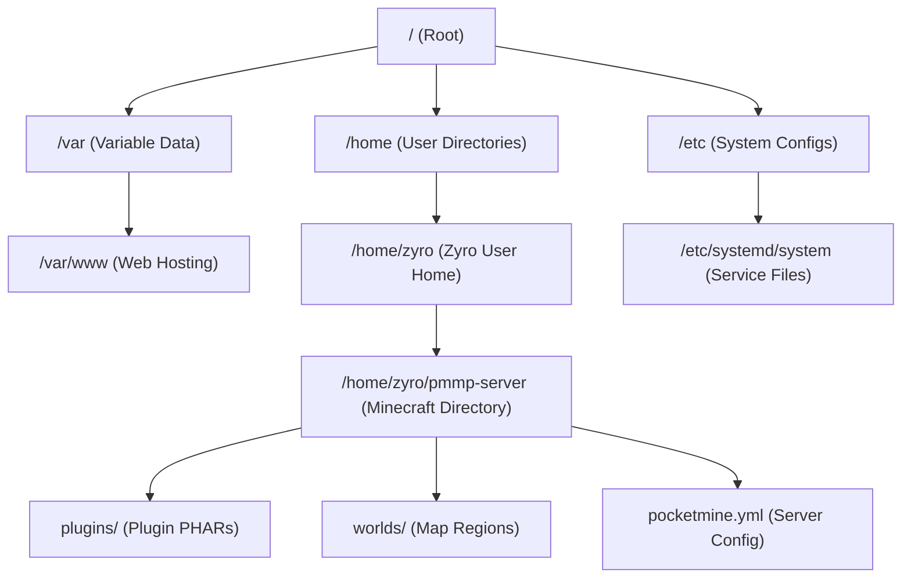

# Ultimate Linux Administration & Bash Guide

Hosting Minecraft Bedrock servers at scale requires managing them via the command line interface (CLI) on a Linux system. This guide covers every essential command, process management utility, network configuration, and directory permission structure you need to run high-performance servers, modeled after professional online engineering curriculums.

---

## 1. Directory Structure

Linux uses a single unified tree structure where everything starts at the root directory (`/`). 

### Minecraft Server Directory Layout

Here is a visual map of the standard directory path structures utilized when deploying PocketMine-MP, Nukkit, or Dragonfly servers:

---

## 2. Command-Line Reference (High Detail)

### File & Directory Management

#### 1. `ls` (List)
List files and folders in the current directory.
- **Usage**: `ls [options]`
- **Common Flags**:
  - `ls -l`: Long format (shows permissions, owner, size, modification date).
  - `ls -a`: Show hidden files (files starting with a dot, e.g., `.htaccess` or `.gitignore`).
  - `ls -la`: Combine long format and hidden files.

#### 2. `cd` (Change Directory)
Navigate between directories.
- **Usage**: `cd [path]`
- **Examples**:
  - `cd pmmp-server`: Move into the `pmmp-server` directory.
  - `cd ..`: Move up one folder level.
  - `cd ~`: Jump directly to the user's home directory.

#### 3. `pwd` (Print Working Directory)
Display the absolute file path of your current folder.
- **Usage**: `pwd`

#### 4. `mkdir` (Make Directory)
Create one or multiple new folders.
- **Usage**: `mkdir [folder_name]`
- **Flags**: `mkdir -p parent/child` (creates parent directories if they don't exist).

#### 5. `rm` (Remove)
Delete files or folders.
- **Usage**: `rm [options] [target]`
- **Flags**:
  - `rm -r`: Deletes recursively (required for folders).
  - `rm -f`: Force delete (ignores warnings).
  - `rm -rf`: Deletes folders recursively and forcefully. **Use with extreme caution!**

---

### Process & Session Management

To run your game servers continuously in the background, you must manage terminal sessions using `screen` or `systemd`.

#### 1. `screen` (Terminal Multiplexer)
Allows you to start a terminal screen, run the server, detach, and close your SSH client without stopping the server.
- **Usage**:
  - `screen -S [name]`: Start a new screen session with a custom name.
  - `Ctrl + A` then `D`: Detach from the active screen session.
  - `screen -ls`: List active screen sessions.
  - `screen -r [name]`: Resume/reattach to a background session.

---

### System Monitoring

#### 1. `htop` (Interactive Process Viewer)
Monitor CPU cores, RAM usage, and running processes in real-time. Extremely useful for identifying lag spikes.
- **Usage**: `htop`

#### 2. `df -h` (Disk Free)
Show available disk space in human-readable formats (GB/MB).
- **Usage**: `df -h`

---

## 3. Test Your Linux Knowledge!

Take this comprehensive 10-question quiz to test your system administration skills!

import Quiz from '@site/src/components/Quiz';

<Quiz questions={[
  {
    question: "Which Linux directory is typically used to store user home folders (e.g. /home/zyro)?",
    options: [
      "/var",
      "/etc",
      "/home",
      "/usr"
    ],
    correctAnswer: 2,
    explanation: "/home contains the personal directories for normal system users."
  },
  {
    question: "What does the '-a' flag do in the 'ls' command?",
    options: [
      "Sorts files alphabetically.",
      "Displays file sizes in megabytes.",
      "Lists all files, including hidden files starting with a dot.",
      "Deletes all files in the folder."
    ],
    correctAnswer: 2,
    explanation: "The -a (all) flag shows hidden files, which are hidden by default in Linux."
  },
  {
    question: "Which command is used to display the absolute path of the current directory?",
    options: [
      "cd",
      "pwd",
      "path",
      "dir"
    ],
    correctAnswer: 1,
    explanation: "pwd (print working directory) displays the full absolute path from the root directory."
  },
  {
    question: "Which command deletes a folder named 'old-server' and all its contents recursively and forcefully?",
    options: [
      "rm old-server",
      "rmdir old-server",
      "rm -rf old-server",
      "del /s old-server"
    ],
    correctAnswer: 2,
    explanation: "rm -rf is the recursive and force flag combo required to delete non-empty directories."
  },
  {
    question: "How do you detach from an active 'screen' session without stopping the process running inside it?",
    options: [
      "Press Ctrl + C",
      "Type 'exit' and press Enter",
      "Press Ctrl + A, then D",
      "Close the terminal window immediately"
    ],
    correctAnswer: 2,
    explanation: "Ctrl + A followed by D safely detaches the screen session, moving it to the background."
  },
  {
    question: "Which command is used to monitor CPU, RAM, and active processes interactively in real-time?",
    options: [
      "htop",
      "df -h",
      "free",
      "ps aux"
    ],
    correctAnswer: 0,
    explanation: "htop provides a colorful, interactive process monitoring dashboard directly in the terminal."
  },
  {
    question: "What does the command 'cd ~' accomplish?",
    options: [
      "Moves up to the root directory.",
      "Navigates to the user's home directory.",
      "Moves to the previous directory.",
      "Closes the SSH connection."
    ],
    correctAnswer: 1,
    explanation: "The tilde (~) represents the current logged-in user's home folder."
  },
  {
    question: "In system monitoring, what does the command 'df -h' measure?",
    options: [
      "Free memory (RAM).",
      "Remaining disk storage space in human-readable formats.",
      "Active processor count.",
      "Internet bandwidth speeds."
    ],
    correctAnswer: 1,
    explanation: "df stands for disk free, and the -h flag formats bytes into gigabytes (GB) and megabytes (MB)."
  },
  {
    question: "Which command is used to resume a detached screen session named 'lobby'?",
    options: [
      "screen -S lobby",
      "screen -r lobby",
      "screen -ls lobby",
      "screen -d lobby"
    ],
    correctAnswer: 1,
    explanation: "screen -r (resume) is used to reattach to an existing background screen session."
  },
  {
    question: "What is the primary benefit of hosting game servers on Linux compared to Windows?",
    options: [
      "Linux supports more players natively without code edits.",
      "Linux has no graphics card requirements.",
      "Linux has minimal GUI overhead, leaving almost all system resources for server performance.",
      "Linux is completely immune to cyber attacks."
    ],
    correctAnswer: 2,
    explanation: "A headless Linux installation runs without a resource-heavy GUI, dedicating maximum CPU and RAM to the game server."
  }
]} />
