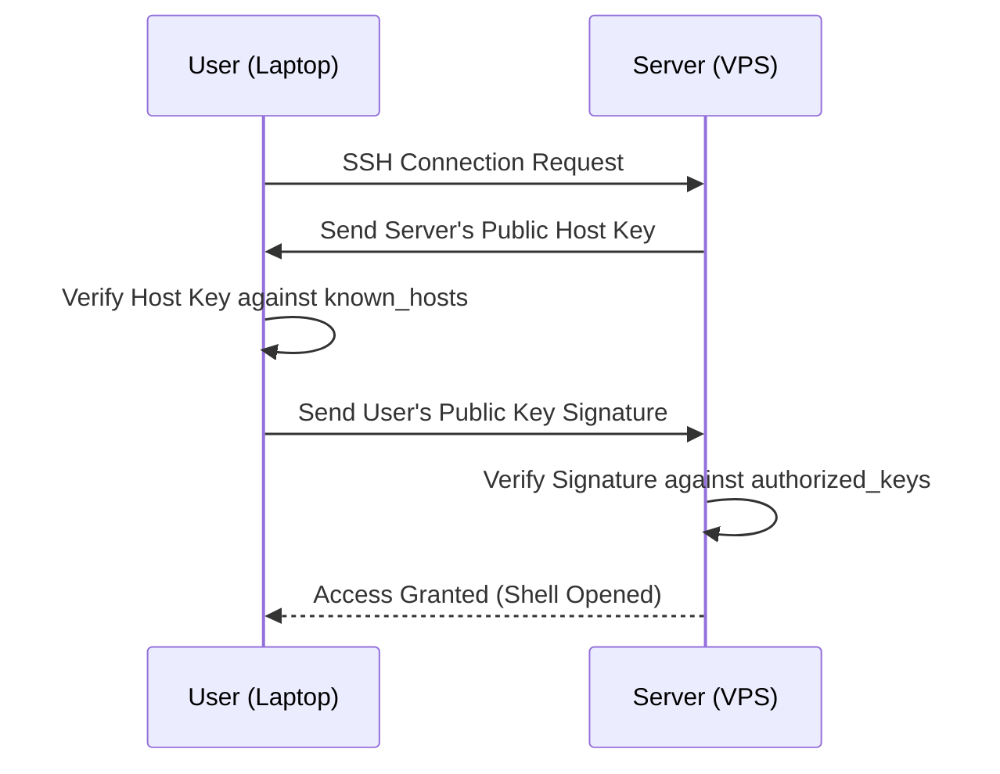

# Introduction to Linux

When hosting a Minecraft server in production, you will almost certainly be using Linux. Windows is excellent for local development, but Linux offers unmatched stability, lower resource consumption, and powerful automation tools for a live server.

## What is Linux?

Linux is a family of open-source Unix-like operating systems based on the Linux kernel. Unlike Windows or macOS, Linux comes in many different "flavors" called **Distributions** (or "Distros").

### Choosing a Distribution for your Server

| Distribution | Package Manager | Use Case | Recommendation |
|---|---|---|---|
| **Ubuntu** | `apt` | The most popular distro. Huge community, tons of tutorials. | **Highly Recommended** for beginners and production PMMP servers. Use the LTS (Long Term Support) versions like 22.04 or 24.04. |
| **Debian** | `apt` | The rock-solid upstream source for Ubuntu. Less bloated, extremely stable. | **Recommended** for advanced users who want maximum stability. |
| **CentOS / Rocky** | `yum` / `dnf`| Enterprise-focused, incredibly stable, but different commands than Ubuntu. | Good, but PHP 8.1+ can be harder to install than on Ubuntu. |

## Choosing a VPS Provider

A **VPS** (Virtual Private Server) is a virtual machine sold as a service by an Internet hosting provider.

| Provider | Pros | Cons |
|---|---|---|
| **Hetzner** | Incredible price-to-performance ratio. Dedicated CPU cores available. | Mostly Europe-based (US locations limited). Strict anti-fraud signup. |
| **Contabo** | Extremely cheap for massive amounts of RAM. | Slower CPU performance (high steal time). |
| **DigitalOcean** | Very easy to use, great UI and documentation. | More expensive per GB of RAM. |
| **OVH / SYS** | Fantastic DDoS protection built for game servers. | Support can be slow. |

## Connecting to Your Server (SSH)

Once you rent a VPS, the provider will give you an IP address and a root password. You connect to it using **SSH** (Secure Shell).

### On Windows
Modern Windows 10/11 has SSH built into the Command Prompt or PowerShell. You can also download [PuTTY](https://www.putty.org/) if you prefer a GUI tool.

Open PowerShell and type:
```bash
ssh root@your_server_ip
```
It will ask if you trust the host (type `yes`) and then prompt for your password. **Note: When typing your password in Linux, the characters will not show up on the screen. This is a security feature. Just type it and press Enter.**

### Setting up SSH Keys (Recommended)
Passwords can be brute-forced. SSH Keys use cryptographic math to authenticate you safely.

1. **Generate a keypair on your local machine:**
   ```bash
   ssh-keygen -t ed25519 -C "your_email@example.com"
   ```
   Press Enter to save it in the default location.

2. **Copy the public key to your server:**
   ```bash
   ssh-copy-id root@your_server_ip
   ```

Now, when you type `ssh root@your_server_ip`, you will log in instantly without a password!



## Understanding the Shell

When you connect via SSH, you are dropped into a **Shell**. The shell is a program that takes commands from the keyboard and gives them to the operating system to perform.

The most common shell is **Bash** (Bourne Again SHell).

### Command Anatomy

Every Linux command follows a basic structure:
`command -flags arguments`

```bash
ls -l /var/log
```
- **Command (`ls`)**: What to do (List directory contents)
- **Flag (`-l`)**: How to do it (Long format)
- **Argument (`/var/log`)**: What to do it on (The `/var/log` directory)

### Getting Help

If you don't know what a command does or what flags it accepts, ask Linux!

```bash
# Read the full manual page (press 'q' to quit)
man ls

# Get a quick summary of flags
ls --help

# Give a one-line description of a command
whatis grep
```

### Shell History and Shortcuts

Linux remembers your previous commands.
- Press **Up Arrow** to scroll through past commands.
- Type `history` to see the full list.
- Press **Ctrl+R** to search your history (start typing a previous command).
- Type `!!` to repeat the very last command.

:::tip The Sudo Trick
If you forget to run a command as root and get a "Permission Denied" error, simply type `sudo !!` to instantly repeat the previous command with root privileges!
:::

---

import Quiz from '@site/src/components/Quiz';

<Quiz questions={[
  {
    question: "Which Linux distribution is highly recommended for beginners and uses the 'apt' package manager?",
    options: ["CentOS", "Arch", "Ubuntu", "FreeBSD"],
    correctAnswer: 2,
    explanation: "Ubuntu is the most widely used server distro for beginners, featuring a massive community and utilizing the apt package manager."
  },
  {
    question: "What does VPS stand for?",
    options: ["Visual Programming System", "Virtual Private Server", "Variable Processor Speed", "Virtual Public Storage"],
    correctAnswer: 1,
    explanation: "A Virtual Private Server is a virtual machine sold as a service by an Internet hosting provider."
  },
  {
    question: "Which network protocol is used to securely log into a remote Linux server?",
    options: ["FTP", "HTTP", "SSH", "Telnet"],
    correctAnswer: 2,
    explanation: "SSH (Secure Shell) provides a secure channel over an unsecured network in a client-server architecture."
  },
  {
    question: "Why does the password not appear on the screen when typing it during an SSH login?",
    options: ["The terminal is broken.", "It is a standard security feature to prevent shoulder-surfing.", "You need to press a special key first.", "SSH is disconnected."],
    correctAnswer: 1,
    explanation: "Linux terminals intentionally hide password input (no asterisks or dots) to prevent anyone looking at your screen from knowing the length of your password."
  },
  {
    question: "What is the primary benefit of using SSH Keys over passwords?",
    options: ["They are shorter and easier to type.", "They are cryptographically secure and prevent brute-force attacks.", "They allow multiple users to share the same account.", "They bypass firewalls automatically."],
    correctAnswer: 1,
    explanation: "SSH Keys use asymmetric cryptography, making them immune to standard brute-force password guessing attacks."
  },
  {
    question: "In the command 'ls -l /var/log', what does '-l' represent?",
    options: ["The command", "The argument", "A flag/option", "The directory"],
    correctAnswer: 2,
    explanation: "'-l' is a flag (or option) that modifies the behavior of the 'ls' command to output in a long, detailed format."
  },
  {
    question: "Which command opens the full manual page for another command?",
    options: ["help", "info", "man", "whatis"],
    correctAnswer: 2,
    explanation: "The 'man' (manual) command displays the user manual of any command that we can run on the terminal."
  },
  {
    question: "What keyboard shortcut allows you to reverse-search through your previously typed commands?",
    options: ["Ctrl+S", "Ctrl+F", "Ctrl+R", "Ctrl+C"],
    correctAnswer: 2,
    explanation: "Ctrl+R opens the reverse-i-search prompt, allowing you to type part of a previous command to find and execute it quickly."
  },
  {
    question: "What does the command '!!' do in a bash shell?",
    options: ["Exits the shell", "Clears the screen", "Repeats the last executed command", "Cancels the current running process"],
    correctAnswer: 2,
    explanation: "'!!' is a history expansion feature in bash that expands to the entire previous command line."
  },
  {
    question: "If you get 'Permission Denied' on a command, what is the fastest way to re-run it with admin privileges?",
    options: ["Type the whole command again with sudo", "sudo !!", "admin -run", "su - retry"],
    correctAnswer: 1,
    explanation: "Because '!!' expands to the last command, typing 'sudo !!' prefixes your last failed command with sudo."
  }
]} />
